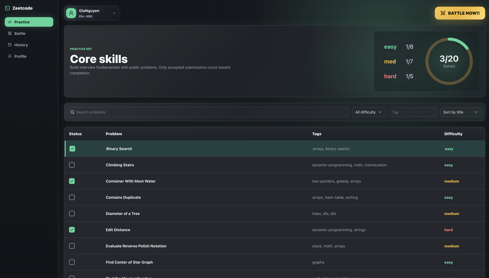
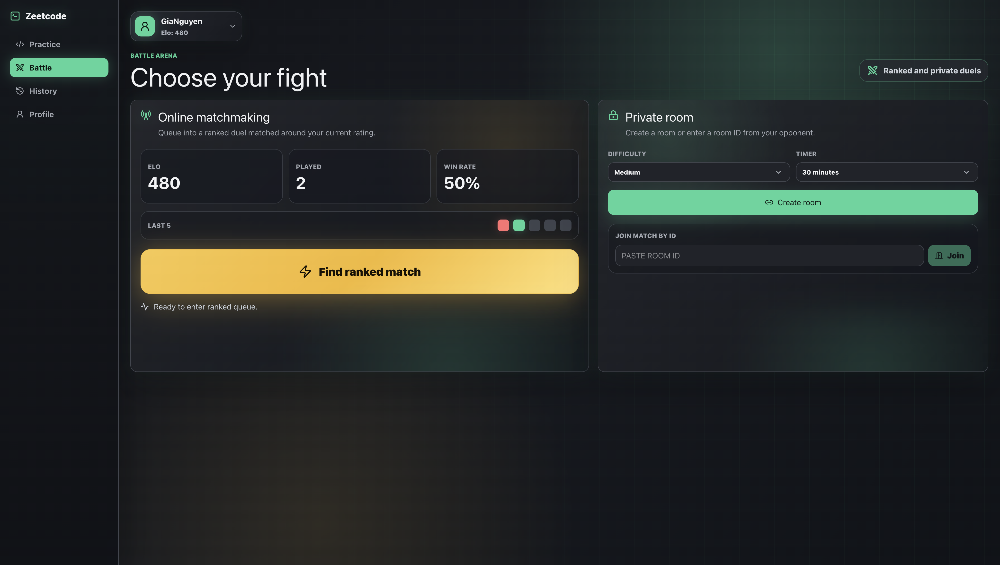
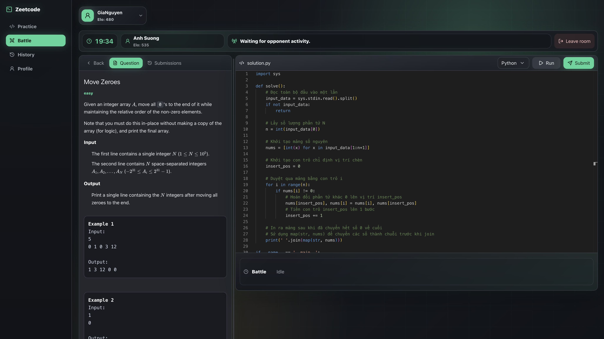
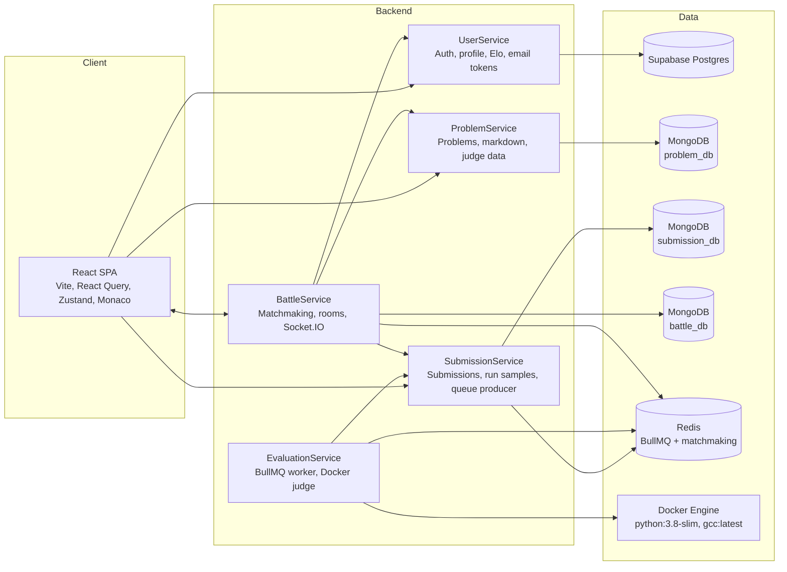
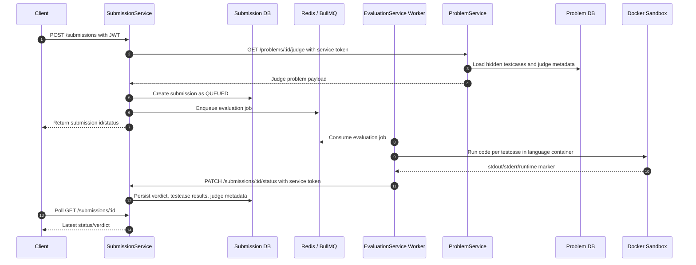
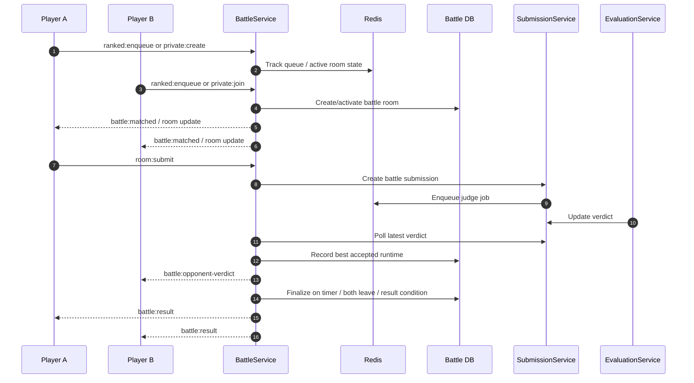

# Zeetcode


Zeetcode is a full-stack competitive programming platform inspired by LeetCode and real-time coding duels. It includes a problem practice workspace, a Docker-based code judge, email-based authentication flows, ranked matchmaking, private battle rooms, battle history, and user profiles.

Live demo: [https://zeetcode.kaitech.id.vn](https://zeetcode.kaitech.id.vn)

> Status: v1 deployed as a portfolio/demo project. The current deployment is optimized for low-concurrency demo traffic.

## Preview

Replace the placeholder images in `assets/readme/` with real screenshots when you want the README to show exact production UI.

| Auth | Practice Workspace |
| --- | --- |
|  |  |

| Battle | Code  |
| --- | --- |
|  |  |

## Why This Project Exists

Zeetcode is built to demonstrate end-to-end product and systems work, not just CRUD screens:

- a real editor workflow with Monaco, language switching, run/submit actions, result polling, and submission history;
- a microservice backend split by ownership boundaries;
- a Redis/BullMQ based asynchronous judge pipeline;
- Docker sandboxing for Python and C++ execution;
- Socket.IO powered battle matchmaking and private rooms;
- JWT authentication, refresh token rotation, email verification, password reset, and service-to-service tokens;
- a deployed Linux VPS setup with Nginx, HTTPS, PM2, MongoDB Atlas, Supabase Postgres, Redis, and Docker.

## Feature Set

### Practice

- Browse and filter algorithm problems by title, tags, status, and difficulty.
- Open a problem workspace with a resizable description/editor layout.
- Write Python or C++ in a Monaco editor.
- Run sample tests without polluting submission history.
- Submit code to the judge.
- View accepted/wrong-answer/runtime-error/compile-error/time-limit states.
- Reuse previous submissions by pasting historical code back into the editor.

### Battle

- Ranked matchmaking with Elo-range checks.
- Private room creation and room-code based joining.
- One active room per user to prevent multi-room state corruption.
- Live battle workspace with timer, opponent info, opponent events, and leave handling.
- Ranked match result calculation with Elo updates.
- Private matches do not change Elo.
- Battle history capped for recent match review.

### Account

- Register and verify email.
- Login with refresh-token based sessions.
- Forgot password and reset password by email token.
- Change username.
- Request password changes by email token.
- View profile age and Elo styling.

## Architecture



## Services

| Service | Responsibility | Storage / Infra |
| --- | --- | --- |
| `fe` | React SPA, practice UI, battle UI, auth/profile/history screens | Vite static build served by Nginx |
| `UserService` | Auth, refresh tokens, email tokens, profile, Elo | Supabase Postgres via Prisma |
| `ProblemService` | Public problem data, sanitized markdown, admin problem mutation, judge problem data | MongoDB Atlas |
| `SubmissionService` | Creates run/submit records, stores submission status, enqueues evaluation jobs | MongoDB Atlas + Redis/BullMQ |
| `EvaluationService` | Consumes judge jobs, executes code in Docker, updates submission verdicts | Redis/BullMQ + Docker |
| `BattleService` | Ranked queue, private rooms, active battle state, Socket.IO events, Elo application | MongoDB Atlas + Redis + Socket.IO |

## Practice Submission Flow

The judge pipeline is asynchronous. `SubmissionService` validates the request, fetches judge-only problem data from `ProblemService`, creates a queued submission document, and publishes an evaluation job to Redis/BullMQ. `EvaluationService` then consumes the job payload, runs code in Docker, and updates the submission verdict through an internal service endpoint.



### Runtime Measurement

The judge measures runtime inside the container after compile/syntax-check and immediately around the actual program execution:

- Python: after `python3 -m py_compile code.py`, around `python3 code.py < input.txt`.
- C++: after `g++ code.cpp -o run`, around `./run < input.txt`.
- `runtimeMs` is summed across executed testcases.
- Compile time and Docker startup time are not included in the normal runtime marker.
- Timeout is enforced outside the container and can include container startup, compile, and run time.

## Battle Flow



## Security and Reliability Notes

- JWT access tokens protect user-facing private routes.
- Refresh tokens are stored server-side as hashes and support rotation/revocation.
- Service-to-service endpoints use `x-service-token`.
- Problem create/update/delete routes require admin access.
- Socket.IO CORS is restricted by `FRONTEND_ORIGIN`.
- Login, reset-password, password-change, submission, and socket events have rate limits.
- Docker judge containers run with memory limits, CPU quota, PID limits, no network, and `no-new-privileges`.
- MongoDB connections use retries, heartbeat checks, and small pool sizes for free-tier stability.

## Tech Stack

### Frontend

- React 19
- TypeScript
- Vite
- React Router
- TanStack Query
- Zustand
- Monaco Editor
- Socket.IO Client
- Tailwind CSS
- Lucide React
- Marked, KaTeX, sanitize-html

### Backend

- Node.js 22
- Express 5
- TypeScript
- MongoDB + Mongoose
- PostgreSQL + Prisma + Supabase
- Redis + BullMQ
- Socket.IO
- Dockerode
- Winston logging
- Zod validation
- Jest + Supertest for UserService tests

### Deployment

- Ubuntu VPS
- Nginx reverse proxy
- Certbot HTTPS
- PM2 process manager
- MongoDB Atlas
- Supabase Postgres
- Docker Engine
- Redis

## Repository Layout

```text
.
├── fe/
│   ├── src/components/features/
│   ├── src/lib/api/
│   ├── src/stores/
│   └── package.json
├── be/
│   ├── UserService/
│   ├── ProblemService/
│   ├── SubmissionService/
│   ├── EvaluationService/
│   ├── BattleService/
│   └── API_CONTRACT.openapi.yaml
├── assets/readme/
├── .github/workflows/
└── README.md
```

## Local Development

### Prerequisites

- Node.js 22+
- npm 10+
- Docker
- Redis
- MongoDB connection strings
- PostgreSQL connection string

### Install

Each app/service has its own `package.json` and lockfile:

```bash
cd fe && npm ci
cd ../be/UserService && npm ci
cd ../ProblemService && npm ci
cd ../SubmissionService && npm ci
cd ../EvaluationService && npm ci
cd ../BattleService && npm ci
```

### Environment Variables

The deployment uses service-local `.env` files:

```text
be/UserService/.env
be/ProblemService/.env
be/SubmissionService/.env
be/EvaluationService/.env
be/BattleService/.env
fe/.env.production
```

Important relationships:

```text
ProblemService.INTERNAL_SERVICE_TOKEN
  = SubmissionService.PROBLEM_SERVICE_TOKEN
  = BattleService.PROBLEM_SERVICE_TOKEN

SubmissionService.INTERNAL_SERVICE_TOKEN
  = EvaluationService.SUBMISSION_SERVICE_TOKEN

UserService.INTERNAL_SERVICE_TOKEN
  = BattleService.USER_SERVICE_TOKEN

JWT_ACCESS_SECRET must match across:
  UserService, ProblemService, SubmissionService, BattleService
```

### Common Commands

Frontend:

```bash
cd fe
npm run dev
npm run build
```

UserService:

```bash
cd be/UserService
npx prisma generate
npx prisma migrate deploy
npm test
```

Backend type checks:

```bash
cd be/ProblemService && npx tsc --noEmit
cd ../SubmissionService && npx tsc --noEmit
cd ../EvaluationService && npx tsc --noEmit
cd ../BattleService && npx tsc --noEmit
```

## CI/CD

GitHub Actions runs CI for `dev`, `main`, and pull requests:

- frontend production build;
- backend TypeScript checks;
- Prisma client generation for `UserService`;
- `UserService` Jest/Supertest suite.

The deploy workflow is intentionally gated by `ENABLE_DEPLOY=true` and uses SSH + PM2 for VPS deployment.

## Current Limitations

- The v1 deployment is sized for portfolio/demo traffic, not public-scale judge traffic.
- The battle flow is implemented for v1, but deeper anti-cheat and replay/audit tooling are future work.


## Author

Built by Nguyen as a full-stack systems project.
